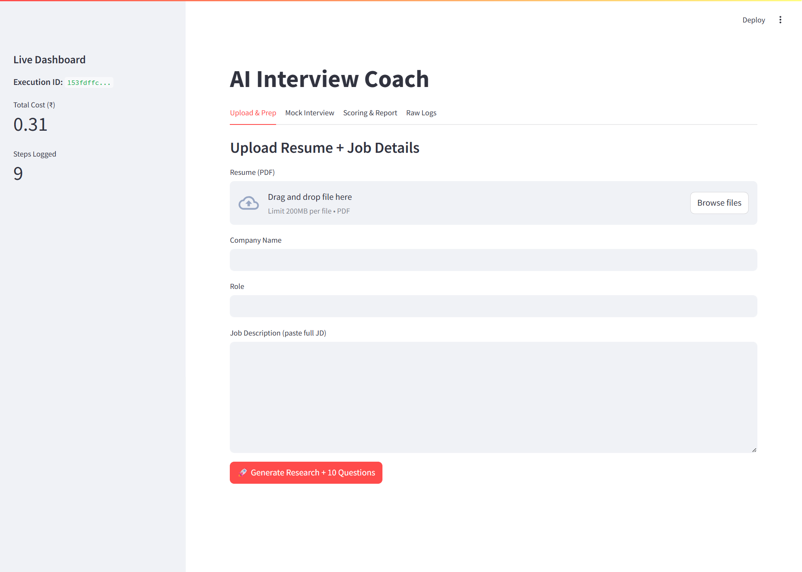
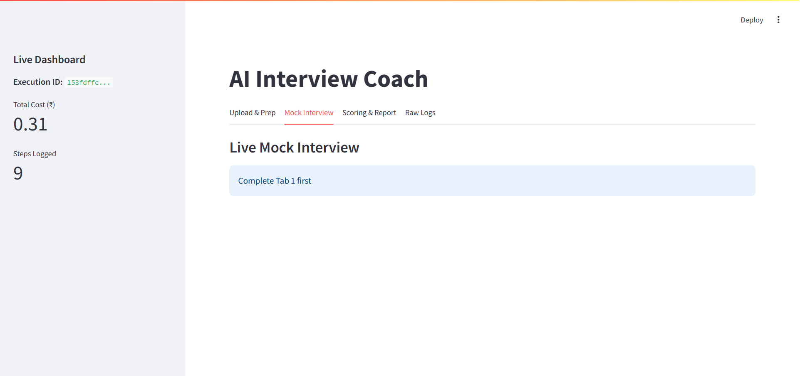
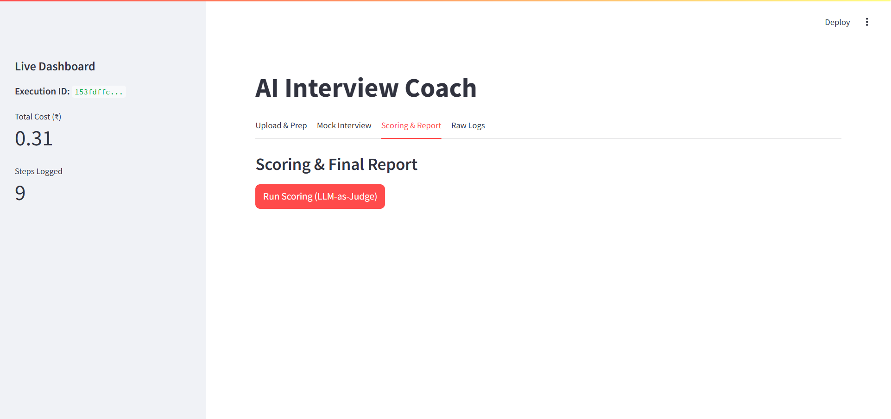
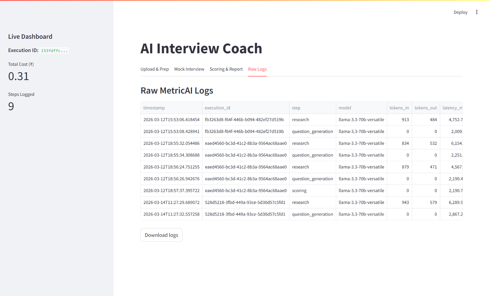

# AI Interview Coach

**Resilient Multi-Step AI Agent with LangGraph + MetricAI Observability**  


## Problem It Solves
Helps Indian freshers and early-career candidates  prepare for real job interviews by providing company-specific questions, live mock practice, and professional scoring.

---

##  Architecture


**LLM Router**: Groq (Llama-3.3-70B) 
**Core Framework**: LangGraph (StateGraph + MemorySaver)  
**Observability**: Full MetricAI-style logging (`runs.jsonl`)

---

##  Key Features

- Intelligent 2-model LLM router with automatic fallback
- Real-time company research using Tavily
- Structured output (Pydantic) for 100% reliable JSON
- Live multi-turn mock interview
- Strict LLM-as-Judge scoring + detailed improvement plan
- Complete MetricAI simulation with token, latency & cost tracking
- 100% free on Groq free tier

---

##  Screenshots

**1. Upload Resume & Generate Questions**  


**2. Live Mock Interview**  


**3. Scoring & Improvement Plan**  


**4. MetricAI Live Dashboard & Logs**  


---

## Demo video 


## Tech Stack

- **LangGraph** – Production-grade multi-step agent workflow
- **Streamlit** – Fast interactive UI
- **Groq + OpenAI + Anthropic** – Smart LLM router
- **Tavily** – Real-time web research
- **PyMuPDF + Pydantic** – Resume parsing & structured output

---

##  How to Run

1. Clone the repository
2. Install dependencies:
   ```bash
   pip install -r requirements.txt

## Add your free API keys in .env:

- **GROQ_API_KEY=gsk_...**
- **TAVILY_API_KEY=tvly-...**

## Run the app
streamlit run app.py

### Project Structure
ai-interview-coach/
├── app.py< br / >
├── langgraph_agent.py< br / >
├── model_router.py< br / >
├── config.py< br / >
├── prompts.py< br / >
├── logger.py< br / >
├── README.md< br / >
├── requirements.txt< br / >
├── .gitignore< br / >
├── .env.example< br / >
├── Arch.pdf< br / >
├── screenshots/< br / >
│   ├── 1-prep.png< br / >
│   ├── 2-interview.png< br / >
│   ├── 3-scoring.png< br / >
│   └── 4-logs.png< br / >
├── nodes/< br / >
│   ├── __init__.py< br / >
│   ├── research_node.py< br / >
│   ├── question_gen_node.py< br / >
│   ├── interview_node.py< br / >
│   └── scoring_node.py< br / >
├── utils/< br / >
│   ├── __init__.py< br / >
│   ├── resume_parser.py< br / >
│   └── cost_calculator.py< br / >
└── logs/< br / >

